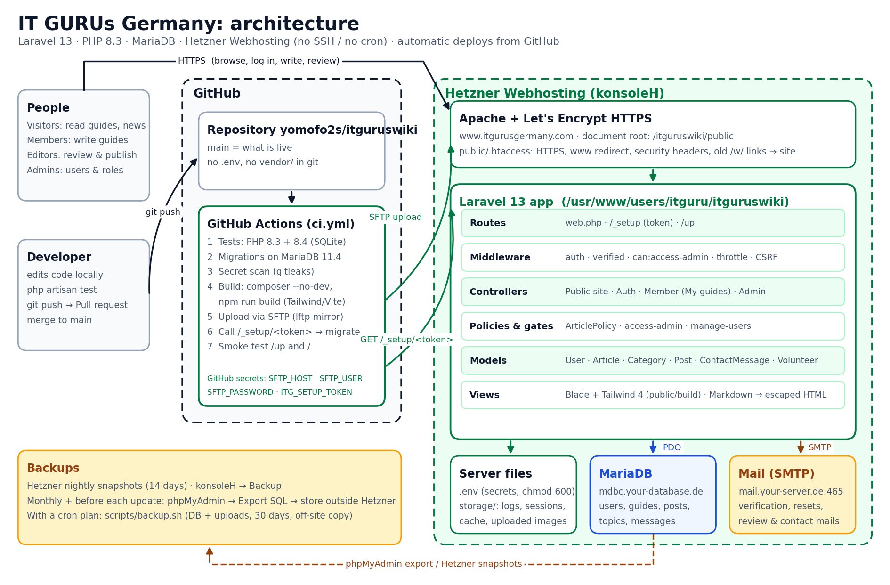

# IT GURUs Germany

Help make our life better with good news.

The community website for Nigerians and Africans living in, or moving to, Germany. It collects
verified, up-to-date guides on studying, work, visas, family reunion and everyday life, plus
news, events and a volunteer programme.

- Live: https://www.itgurusgermany.com
- Project board: https://github.com/users/yomofo2s/projects/3



## Features

| Area | What it does |
|---|---|
| **Guides** (knowledge base) | Topics, full-text search, Markdown articles with tables, cover images, official source links, reading time, view counts |
| **Editorial workflow** | Members write guides → *Submit for review* → editors **publish** or **request changes** (authors get an email) |
| **News & events** | News posts and events with date, location and registration link. Scheduling via a publish date |
| **Community** | Volunteer sign-up, social links, upcoming events, contact form (stored + emailed) |
| **Accounts** | Registration with email verification, login with rate limiting, password reset, profile, self-service account deletion |
| **Roles** | `member` writes guides · `editor` reviews/publishes, manages news, topics, inbox · `admin` also manages roles |
| **Admin area** | `/admin`: review queue, guides, news & events, topics, messages, volunteers, users & roles |
| **Security** | Escaped Markdown (no HTML/JS injection), CSRF, honeypots and throttling on public forms, policies on every action, HTTPS + security headers |

## Tech stack

- **Laravel 13** (PHP 8.3+), Blade, Tailwind CSS 4 (built with Vite), self-hosted Inter font (no Google calls, GDPR-friendly)
- **MariaDB** in production (Hetzner Webhosting). SQLite for local development and tests
- Hosting plan without SSH or cron: mail is sent immediately (`QUEUE_CONNECTION=sync`), sessions and cache are stored in files,
  and database migrations run through a token-protected setup link (`/_setup/<token>`)

## Deployment

**Every merge to `main` deploys automatically** (`.github/workflows/ci.yml`):

1. Tests on PHP 8.3 and 8.4, migrations on MariaDB, secret scan
2. Production build: `composer install --no-dev` + `npm run build`
3. SFTP upload to Hetzner. `.env`, uploads, logs and sessions on the server are never touched
4. `/_setup/<token>` runs new migrations, then a smoke test of `/up` and `/`

Needs the GitHub secrets `SFTP_HOST`, `SFTP_USER`, `SFTP_PASSWORD`, `ITG_SETUP_TOKEN` and the variable `DEPLOY_ENABLED=true`.
Full runbook, first-time setup and backups: [docs/HOSTING.md](docs/HOSTING.md).

## Local development

Requirements: PHP 8.3+, Composer, Node 20+.

```bash
git clone git@github.com:yomofo2s/itguruswiki.git && cd itguruswiki
composer install
cp .env.example .env && php artisan key:generate
touch database/database.sqlite
php artisan migrate --seed
php artisan db:seed --class=DemoSeeder   # optional sample content
npm install && npm run build            # or: npm run dev (hot reload)
php artisan serve                       # http://localhost:8000
```

Demo logins (DemoSeeder): `admin@example.com` / `editor@example.com`, password `password`.
Create a real admin with `php artisan app:create-admin you@example.com`.

Optional: `docker compose up -d` starts MariaDB and Mailpit (see `compose.yaml`).

Run the tests: `php artisan test`.

## Project layout

| Path | Purpose |
|---|---|
| `app/Models`, `app/Enums` | Article, Category, Post, User (+ Role), ContactMessage, Volunteer |
| `app/Http/Controllers` | Public site, `Auth/`, member area (`MyArticleController`), `Admin/` |
| `app/Policies/ArticlePolicy.php` | Who may view, edit, delete and moderate guides |
| `resources/views` | Blade templates. `components/layouts` has the app, auth and admin layouts |
| `database/seeders` | `CategorySeeder` (production topics), `DemoSeeder` (local sample data) |
| `routes/web.php`, `routes/console.php` | Routes, `app:create-admin`, scheduler |
| `app/Http/Controllers/SetupController.php` | Token-protected `/_setup` link: migrations and first admin (no SSH needed) |
| `.github/workflows/ci.yml` | Tests, build, automatic SFTP deploy |
| `scripts/` | `deploy.sh`, `post-deploy.sh` (SSH plans), `backup.sh` (cron plans) |
| `docs/HOSTING.md` | **Production runbook for Hetzner** |
| `docs/architecture.png` | Architecture diagram |

## Contributing

Clone over SSH, branch off `main`, open a pull request **into `main`**. CI (tests on PHP 8.3/8.4, MariaDB
migrations, secret scan) must be green before merging. Merging deploys to the live site.

```bash
git checkout -b feature/my-change
php artisan test
git push --set-upstream origin feature/my-change
```

Never commit `.env`, passwords, keys or database dumps.

See also the [code of conduct](CODE_OF_CONDUCT.md). Licensed under GPL-3.0.
